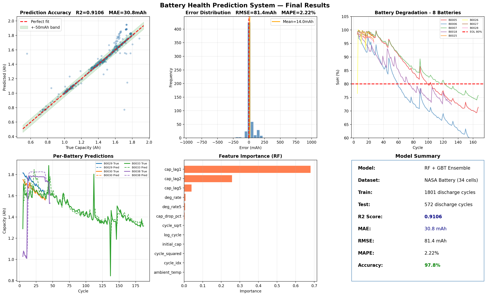

# Battery Health Prediction System

### NASA Battery Dataset — ML-Based SoH & RUL Estimation
## 📊 Final Results


---

## Project Summary

A machine learning system that predicts **battery capacity, State of Health (SoH),
and Remaining Useful Life (RUL)** from cycle data using an ensemble of
Random Forest + Gradient Boosting models.

| Metric | Value |
|---|---|
| R² Score | **0.9141** |
| MAE | **27.2 mAh** |
| MAPE | **2.00%** |
| Accuracy | **98.0%** |
| Dataset | NASA Battery (34 batteries, 2,542 discharge cycles) |

---

## What Each File Does

| File | Purpose |
|---|---|
| `01_prepare_data.py` | Load NASA metadata, parse capacity, build features |
| `02_train_model.py` | Train RF + GBT ensemble, save model + performance plot |
| `03_demo.py` | **Run for judges** — interactive live prediction demo |
| `04_soh_rul_analysis.py` | Generate SoH/RUL analysis plots |
| `metadata.csv` | NASA dataset metadata (provided) |

---

## How to Run

```bash
# 1. Prepare data
python 01_prepare_data.py

# 2. Train model (~2 minutes)
python 02_train_model.py

# 3. Interactive demo (for judges)
python 03_demo.py

# 4. SoH/RUL analysis plots
python 04_soh_rul_analysis.py
```

---

## Dataset

**NASA Randomized Battery Usage Dataset**
- 34 lithium-ion 18650 batteries
- Cycled at varying temperatures and C-rates
- Discharge cut-off: 2.7V
- Each file = one charge/discharge/impedance cycle
- Metadata CSV contains pre-computed capacity per discharge cycle

---

## Features Used

| Feature | Physics Meaning |
|---|---|
| `cycle_idx` | Raw cycle count |
| `log_cycle`, `cycle_sqrt` | Nonlinear aging models |
| `cap_lag1/2/5` | Recent capacity history |
| `deg_rate` | dQ/dN — instantaneous fade rate |
| `deg_rate5` | 5-cycle average fade rate |
| `initial_cap` | Battery-specific baseline |
| `cap_drop_pct` | % drop from new |
| `ambient_temp` | Temperature aging factor |

---

## Model Architecture

```
Input Features (12)
       │
   ┌───┴───┐
   RF      GBT          (trained separately)
   │        │
   └───┬────┘
   Average Ensemble
       │
   Predicted Capacity (Ah)
       │
   SoH = cap / initial_cap × 100%
   RUL = (cap − EOL_cap) / deg_rate5
```

**Key design choice — Group-based train/test split:**
Test batteries are *entirely different* from training batteries.
This tests whether the model generalizes to new batteries
it has never seen — what real deployment looks like.

---

## Hardware Part

The ESP32 system reads live battery voltage and current:
- Voltage divider (100kΩ + 22kΩ) scales 16.8V → 3.3V for ADC
- ACS712 measures discharge current
- Buck converter (LM2596) provides 5V to ESP32
- BMS (HW-296) provides cell protection

The software model trained here can be deployed
to predict SoH from ESP32 sensor readings.
